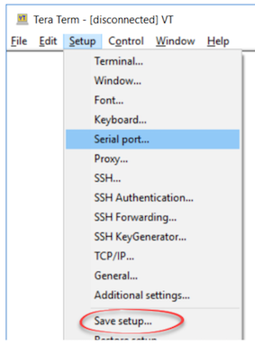

# Quectel-BG96-Firmware-Upgrade
Instructions on how to upgrade the **BG96 module firmware** on  TELUS Sixfab RPi Shield.

`You need Windows Operating System to perform this upgrade.`

## Update Procedure

1. Download, Unzip and Install **Quectel LTE Windows USB driver** (https://iotdevkit.s3.ca-central-1.amazonaws.com/Quectel_LTE_Windows_USB_Driver_V1.0.zip)

2. Download and Unzip **Quectel QFlash Porgrammer** application (https://iotdevkit.s3.ca-central-1.amazonaws.com/QFlash_V4.8.zip)

3. Download and Unzip **BG96 Firmware** file (https://iotdevkit.s3.ca-central-1.amazonaws.com/BG96MAR02A07M1G_01.016.01.016.zip)

4. Open **Windows Device Manager**, expand the **Ports (COM & LPT)** section.

5. Connect micro USB cable to TELUS Sixfab Shield and plug the other end to the computer.

    

6. Press and hold **Power Key** button for 3 seconds.

   

7. Three new COM ports should now be listed under the Ports section of Windows Device Manager

   

8. Launch **QFlash_V4.8.exe** application inside the extracted QFlash_V4.8 folder. `(Note: Paths to the tool and firmware may NOT contain spaces or non-English characters!)`

      

9. Set **Buadrate** to **460800**

10. Set **COM Port** to COM port number of **Quectel USB DM Port**

11. Click **Load FW Files** button. Select **acdb.mbn** file inside **BG96MAR02A07M1G_01.016.01.016\UPDATE** folder and click OK. `QFlash winsow will update with a list of files to be programmed`

      

12. Click **Start** button to upgrade the firmware.

      

13. "**PASS, FW upgrade success**” will display in the status area of the QFlash window after ~2 minutes+ `142 seconds in the screenshot below`

      

14. and you're done!

## Test Procedure (Optional)

This is an optional test to check if the firmware is working after the upgrade. 

You need to ensure the following:
- SIM is inserted in the SIM slot or eSIM switch (`shown in image below`) is selected
- LTE antenna is attached

    

You need these tools:
- Download and Install **TeraTerm** (https://osdn.net/projects/ttssh2/releases/)
- Download **TTL script** here (https://iotdevkit.s3.ca-central-1.amazonaws.com/TELUS_Sixfab_Shield.TTL) 

1. Disconnect and reconnect the Micro-USB cable from BG96 board to the test computer.

2. Press and hold **Power Key** button for 3 seconds.

3. On the Test Computer, open **Windows Device Manager** and take note of the COM ports shown. You will use the COM Port number of AT Port. `Shown in the image below`

   

4. Launch **Tera Term** serial console Windows application.

5. In Tera Term press **ALT+N** (`or use File -> New Connection`) to open the New Connection dialog.
Select Serial, then the COM Port labelled **Quectel USB AT Port**

6. Check serial port settings (`Setup -> Serial Port`), these should be: **115200 8N1**
Save serial port settings (`Setup -> Save Setup`)

    

7. Click on the **Tera Term** console panel and type **ATI** and press enter. `The BG96 should respond with the modem firmware version info displayed in the console`

   
   
8. Tera Term macro will now be used to send a sequence of AT commands. Load the macro by selecting `Control -> Macro` then select **TELUS_Sixfab_Shield.TTL** from the list.

   
   
9. The screenshot shown above indicate successful test - and you're done.
